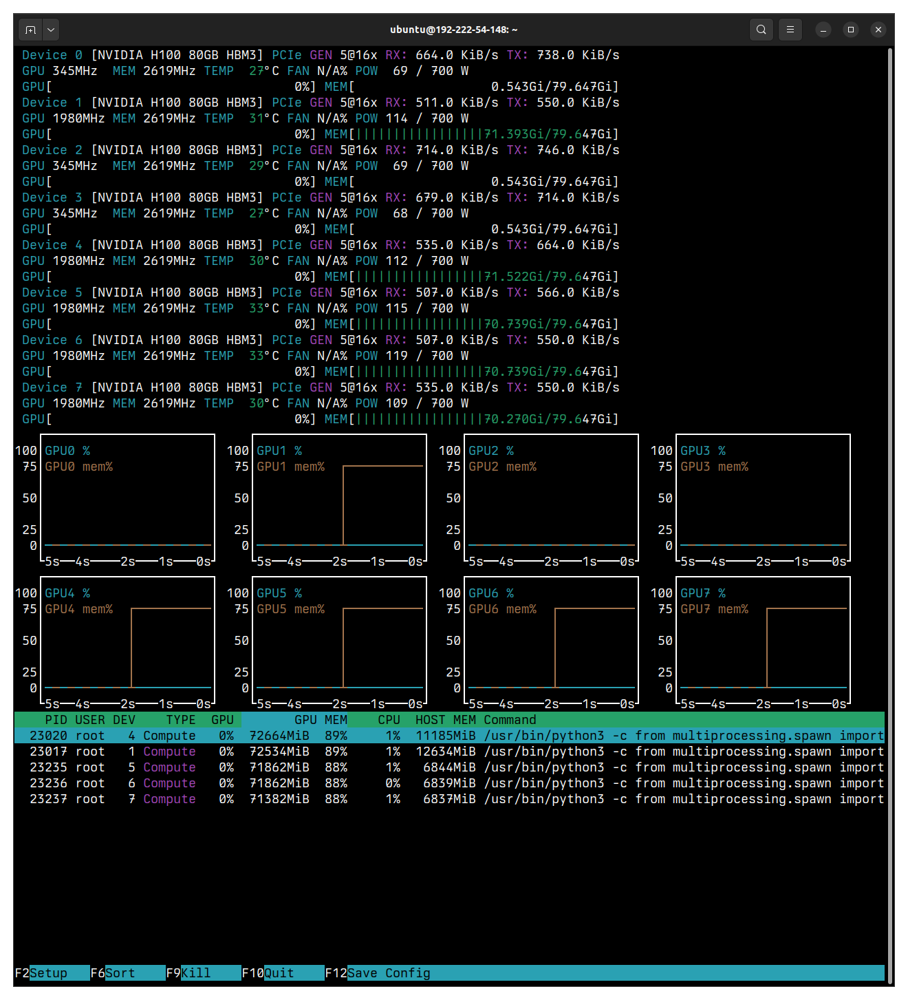
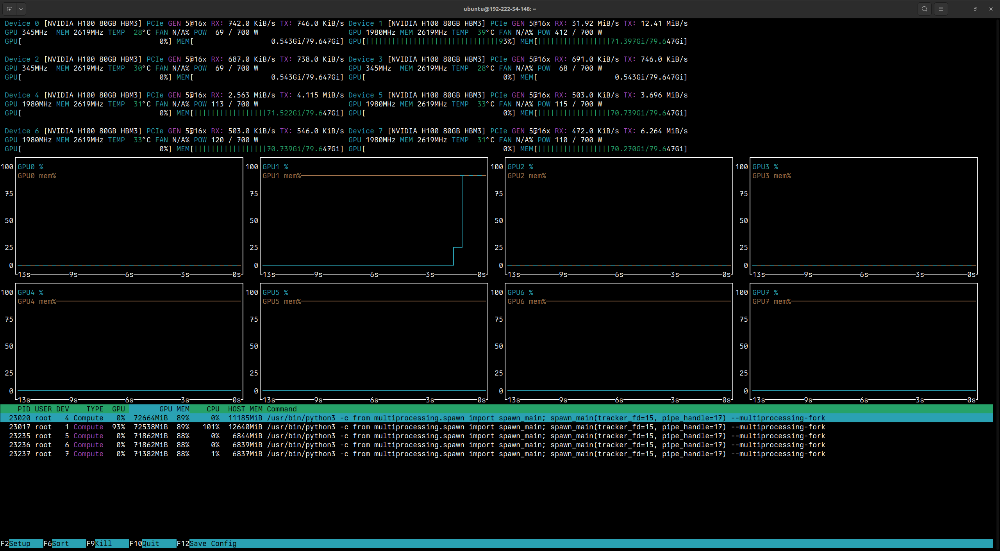

# Using KubeAI to deploy Nous Research's Hermes 3 and other LLMs

## Introduction

[KubeAI: Private Open AI on Kubernetes](https://github.com/substratusai/kubeai){ .external target="_blank" }
is a Kubernetes solution for running inference on open-weight large language
models (LLMs), including
[Nous Research's Hermes 3 fine-tuned Llama 3.1 8B model](https://nousresearch.com/hermes3/){ .external target="_blank" }
and
[NVIDIA's Nemotron fine-tuned Llama 3.1 70B model](https://build.nvidia.com/nvidia/llama-3_1-nemotron-70b-instruct){ .external target="_blank" }.

Using model servers such as
[vLLM](https://blog.vllm.ai/2023/06/20/vllm.html){ .external target="_blank" }
and [Ollama](https://ollama.com/){ .external target="_blank" }, KubeAI enables
you to interact with LLMs using both a web UI
powered by [Open WebUI](https://openwebui.com/){ .external target="_blank" } and
an OpenAI-compatible API.

In this tutorial, you'll:

1. Stand up a single-node Kubernetes cluster on an 8x H100
   [on-demand instance](https://lambdalabs.com/service/gpu-cloud){ .external target="_blank" }
   using [K3s](https://k3s.io/){ .external target="_blank" }.
1. Install the
   [NVIDIA GPU Operator](https://docs.nvidia.com/datacenter/cloud-native/gpu-operator/latest/index.html){ .external target="_blank" }
   so your Kubernetes cluster can use your instance's GPUs.
1. Deploy KubeAI in your Kubernetes cluster to serve both Nous Research's Hermes
   3 model and NVIDIA's Nemotron model.
1. Interact with the models using KubeAI's web UI.
1. Interact with the models using KubeAI's OpenAI-compatible API.
1. Use [NVTOP](https://github.com/Syllo/nvtop){ .external target="_blank" } to
   observe GPU utilization.

## Stand up a single-node Kubernetes cluster

1. Use the
   [dashboard](https://cloud.lambdalabs.com/instances){ .external target="_blank" }
   or [Cloud API](../../public-cloud/cloud-api.md#launching-instances) to launch
   an 8x H100 instance. Then, SSH into your instance by running:

    ```bash
    ssh ubuntu@<INSTANCE-IP-ADDRESS> -L 8080:localhost:8080
    ```

    Replace `<INSTANCE-IP-ADDRESS>` with the IP address of your instance.

    !!! note

        The `-L 8080:localhost:8080` option enables local port forwarding. Local
        port forwarding is needed to securely access KubeAI's web UI from your
        computer.
        [See the SSH man page to learn more](https://manpages.ubuntu.com/manpages/jammy/en/man1/ssh.1.html){ .external target="_blank" }.

1. Install [socat](https://manpages.ubuntu.com/manpages/jammy/man1/socat.1.html){ .external target="_blank" }
   (which is needed for the `kubectl port-forward` command you'll run later in
   this tutorial) by running:

    ```bash
    sudo apt update && sudo apt -y install socat
    ```

1. Install K3s (Kubernetes) by running:

    ```bash
    curl -sfL https://get.k3s.io | K3S_KUBECONFIG_MODE=644 sh -s - --default-runtime=nvidia
    ```

1. Verify that your Kubernetes cluster is ready by running:

    ```bash
    kubectl get nodes
    ```

    You should see output similar to:

    ```{.text .no-copy}
    NAME             STATUS   ROLES                  AGE   VERSION
    192-222-54-148   Ready    control-plane,master   1s    v1.30.5+k3s1
    ```

!!! tip

    You can enable tab completion for `kubectl` by running:

    ```bash
    echo "source <(kubectl completion bash)" >> ~/.bashrc && source ~/.bashrc
    ```

## Install the NVIDIA GPU Operator

1. Install the NVIDIA GPU Operator in your Kubernetes cluster by running:

    ```bash
    cat <<EOF | kubectl apply -f -
    apiVersion: v1
    kind: Namespace
    metadata:
      name: gpu-operator
    ---
    apiVersion: helm.cattle.io/v1
    kind: HelmChart
    metadata:
      name: gpu-operator
      namespace: gpu-operator
    spec:
      repo: https://helm.ngc.nvidia.com/nvidia
      chart: gpu-operator
      targetNamespace: gpu-operator
    EOF
    ```

1. In a few minutes, verify that your instance's GPUs are detected by your
   cluster by running:

    ```bash
    kubectl describe nodes | grep nvidia.com
    ```

    You should see output similar to:

    ```{.text .no-copy}
    nvidia.com/cuda.driver-version.full=535.129.03
    nvidia.com/cuda.driver-version.major=535
    nvidia.com/cuda.driver-version.minor=129
    nvidia.com/cuda.driver-version.revision=03
    nvidia.com/cuda.driver.major=535
    nvidia.com/cuda.driver.minor=129
    nvidia.com/cuda.driver.rev=03
    nvidia.com/cuda.runtime-version.full=12.2
    nvidia.com/cuda.runtime-version.major=12
    nvidia.com/cuda.runtime-version.minor=2
    nvidia.com/cuda.runtime.major=12
    nvidia.com/cuda.runtime.minor=2
    nvidia.com/gfd.timestamp=1729173628
    nvidia.com/gpu-driver-upgrade-state=upgrade-done
    nvidia.com/gpu.compute.major=9
    nvidia.com/gpu.compute.minor=0
    nvidia.com/gpu.count=8
    nvidia.com/gpu.deploy.container-toolkit=true
    nvidia.com/gpu.deploy.dcgm=true
    nvidia.com/gpu.deploy.dcgm-exporter=true
    nvidia.com/gpu.deploy.device-plugin=true
    nvidia.com/gpu.deploy.driver=pre-installed
    nvidia.com/gpu.deploy.gpu-feature-discovery=true
    nvidia.com/gpu.deploy.mig-manager=true
    nvidia.com/gpu.deploy.node-status-exporter=true
    nvidia.com/gpu.deploy.operator-validator=true
    nvidia.com/gpu.family=hopper
    nvidia.com/gpu.machine=Standard-PC-Q35-ICH9-2009
    nvidia.com/gpu.memory=81559
    nvidia.com/gpu.mode=compute
    nvidia.com/gpu.present=true
    nvidia.com/gpu.product=NVIDIA-H100-80GB-HBM3
    nvidia.com/gpu.replicas=1
    nvidia.com/gpu.sharing-strategy=none
    nvidia.com/mig.capable=true
    nvidia.com/mig.config=all-disabled
    nvidia.com/mig.config.state=success
    nvidia.com/mig.strategy=single
    nvidia.com/mps.capable=false
    nvidia.com/vgpu.present=false
    nvidia.com/gpu-driver-upgrade-enabled: true
    ```

    `nvidia.com/gpu.count=8` indicates that your cluster detects 8 GPUs.

    `nvidia.com/gpu.product=NVIDIA-H100-80GB-HBM3` indicates that the detected
    GPUs are NVIDIA-H100-80GB-HBM3 GPUs.

## Install KubeAI

1. Install KubeAI by running:

    ```bash
    cat <<EOF | kubectl apply -f -
    apiVersion: v1
    kind: Namespace
    metadata:
      name: kubeai
    ---
    apiVersion: helm.cattle.io/v1
    kind: HelmChart
    metadata:
      name: kubeai
      namespace: kubeai
    spec:
      repo: https://www.kubeai.org
      chart: kubeai
      targetNamespace: kubeai
    EOF
    ```

    Ths installation usually takes 2 to 3 minutes to finish.

1. To know when KubeAI is installed and ready, run:

    ```bash
    kubectl get -n kubeai -w --field-selector=status.phase=Running pods
    ```

    This command watches for and displays pods running in the `kubeai`
    namespace.

    KubeAI is installed and ready once you see output similar to:

    ```{.text .no-copy}
    kubeai-5f6cb9984b-nghpj   1/1     Running   0          10s
    ```

    Note `1/1` which indicates 1 pod out of the 1 requested is ready.

1. To stop watching, press ++ctrl++ + ++c++.

## Download and serve the Hermes 3 and Nemotron models

1. Download and serve both Nous Research's Hermes 3 model and NVIDIA's Nemotron
   model using vLLM by running:

    ```bash
    cat <<EOF | kubectl apply -f -
    apiVersion: kubeai.org/v1
    kind: Model
    metadata:
      name: hermes-3-llama-3.1-8b
      namespace: kubeai
    spec:
      features: [TextGeneration]
      owner: NousResearch
      url: hf://NousResearch/Hermes-3-Llama-3.1-8B
      engine: VLLM
      resourceProfile: nvidia-gpu-h100:1
      minReplicas: 1
    ---
    apiVersion: kubeai.org/v1
    kind: Model
    metadata:
      name: llama-3.1-nemotron-70b-instruct
      namespace: kubeai
    spec:
      features: [TextGeneration]
      owner: nvidia
      url: hf://nvidia/Llama-3.1-Nemotron-70B-Instruct-HF
      engine: VLLM
      resourceProfile: nvidia-gpu-h100:4
      minReplicas: 1
      args:
        - --tensor-parallel-size=4
    EOF
    ```

    !!! note

        The Hermes 3 model can be loaded onto a single GPU. Accordingly,
        `spec.resourceProfile` is set to `nvidia-gpu-h100:1` to allocate a
        single GPU to the Hermes 3 model.

        On the other hand, the Nemotron model can't be loaded onto a single GPU.
        Accordingly, `spec.resourceProfile` is set to `nvidia-gpu-h100:4` to
        allocate 4 GPUs to the Nemotron model. Also, the argument
        `--tensor-parallel-size=4` is passed to vLLM to divide the Nemotron
        model among the 4 allocated GPUs using a tensor parallelism strategy.

        [See vLLM's documentation on distributed inference and serving to learn more](https://docs.vllm.ai/en/v0.6.0/serving/distributed_serving.html){ .external target="_blank" }.

1. To know when the models are downloaded and being served, run:

    ```bash
    kubectl get -n kubeai -w --field-selector=status.phase=Running pods | grep model-
    ```

1. The models are downloaded and being served once you see output similar to.

    ```{.text .no-copy}
    model-hermes-3-llama-3.1-8b-79cdb64947-cb7cd             1/1     Running   0          2m21s
    model-llama-3.1-nemotron-70b-instruct-57cf757d9d-nc9l4   1/1     Running   0          5m5s
    ```

    Note `1/1` for each model, which indicates 1 pod out of the 1 pod requested
    for each model is running.

1. To stop watching, press ++ctrl++ + ++c++.

## Interact with the models using KubeAI's web UI

1. Run the following command to make the KubeAI web UI accessible from your
   computer:

    ```bash
    kubectl -n kubeai port-forward service/openwebui 8080:80 &> /dev/null &
    ```

1. In your web browser, go to <http://localhost:8080>{ .external target="_blank" }. Then, at the top-left of
   the page, click **Select a model** and choose either:

    - **hermes-3-llama-3.1-8b** for the Hermes 3 model.
    - **llama-3.1-nemotron-70b-instruct** for the Nemotron model.

1. At the bottom of the page, in the **Send a Message** field, enter a prompt to
   test the chosen model, for example:

    ```
    In a small table, compare and contrast machine learning and deep learning.
    ```

    You should see output similar to:

    

## Interact with the models using KubeAI's OpenAI-compatible API

1. On your instance, install `curl` and `jq` by running:

    ```bash
    sudo apt update && sudo apt -y install curl jq
    ```

1. Enable access to KubeAI's OpenAI-compatible API by running:

    ```bash
    kubectl -n kubeai port-forward service/kubeai 8081:80 &> /dev/null &
    ```

1. List the models KubeAI is serving using the API's `/models` endpoint by
   running:

    ```bash
    curl -sS http://localhost:8081/openai/v1/models | jq .
    ```

    You should see output similar to:

    ```{ .json .no-copy }
    {
      "object": "list",
      "data": [
        {
          "id": "llama-3.1-nemotron-70b-instruct",
          "created": 1729174478,
          "object": "model",
          "owned_by": "nvidia",
          "features": [
            "TextGeneration"
          ]
        },
        {
          "id": "hermes-3-llama-3.1-8b",
          "created": 1729174478,
          "object": "model",
          "owned_by": "NousResearch",
          "features": [
            "TextGeneration"
          ]
        }
      ]
    }
    ```

1. Submit an example prompt to the API by running:

    ```bash
    curl -sS -d @- http://localhost:8081/openai/v1/completions -H "Content-Type: application/json" <<EOF | jq .
    {
      "model": "llama-3.1-nemotron-70b-instruct",
      "prompt": "Machine learning engineers are ",
      "temperature": 0
    }
    EOF
    ```

    In the above example, the Nemotron model is responding to the prompt
    `Machine learning engineers are`.

    You should see output similar to:

    ```{ .json .no-copy }
    {
      "id": "cmpl-04a8ee4abf7247b5859755e7684ade21",
      "object": "text_completion",
      "created": 1729179938,
      "model": "llama-3.1-nemotron-70b-instruct",
      "choices": [
        {
          "index": 0,
          "text": "2023’s most in-demand tech professionals\nAccording to a new report from Indeed",
          "logprobs": null,
          "finish_reason": "length",
          "stop_reason": null,
          "prompt_logprobs": null
        }
      ],
      "usage": {
        "prompt_tokens": 6,
        "total_tokens": 22,
        "completion_tokens": 16
      }
    }
    ```

!!! tip

    [See vLLM's documentation to learn more about using the API](https://docs.vllm.ai/en/v0.6.0/getting_started/quickstart.html#openai-compatible-server){ .external target="_blank" }.

## Use NVTOP to observe GPU utilization

1. On your instance, run:

    ```bash
    nvtop -d 2
    ```

    You should see output similar to:

    

    The above example output shows the models are loaded on:

    - `GPU1`
    - `GPU4`
    - `GPU5`
    - `GPU6`
    - `GPU7`

    Note the memory usage.

    The output further shows the following GPUs are unallocated and can be used
    for other work:

    - `GPU0`
    - `GPU2`
    - `GPU3`

    Again, note the memory usage or, in this case, the lack of memory usage.

1. In your browser, go again to
   <http://localhost:8080>{ .external target="_blank" }. Select the
   `llama-3.1-nemotron-70b-instruct` model.

1. Enter an example prompt, such as:

    ```
    In 10,000 words or more, explain what large language models are.
    ```

    In `nvtop`, you should see output that momentarily looks like:

    

    The output shows that `GPU4` through `GPU7` are utilized for running
    inference on the Nematron model.

1. In your browser, select the `hermes-3-llama-3.1-8b` model and enter the same
   prompt. You should see output that momentarily looks like:

    

    The output shows that `GPU1` is utilized for running inference on the Hermes
    3 model.
