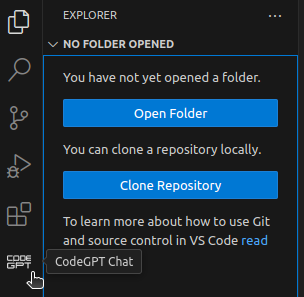
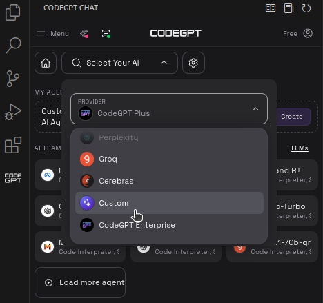
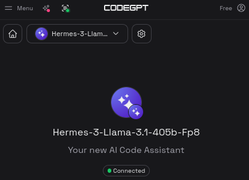

# Integrating Lambda Chat into VS Code

## Introduction

Using the
[CodeGPT VS Code (Visual Studio Code) extension :octicons-link-external-16:](https://marketplace.visualstudio.com/items?itemName=DanielSanMedium.dscodegpt){target="_blank"},
you can integrate
[Lambda Chat :octicons-link-external-16:](https://lambda.chat/chatui/){target="_blank"}
into VS Code. Once integrated, Lambda Chat can help explain code, find problems
in code, and much more.
[See CodeGPT's documentation to learn more :octicons-link-external-16:](https://docs.codegpt.co/docs/intro){target="_blank"}.

For this tutorial, you need to
[generate a Cloud API key :octicons-link-external-16:](https://cloud.lambdalabs.com/api-keys){target="_blank"}.
You can also use an existing Cloud API key.

## Install the CodeGPT extension

First, open VS Code.

Press ++ctrl++ + ++p++ to open **Quick Open**. Enter the following:

```
ext install DanielSanMedium.dscodegpt
```

Then, press ++enter++ to install the CodeGPT extension.

## Configure the Lambda Chat integration

In the Primary Side Bar, click the **CODEGPT** button.



Select **Select Your AI** > **Provider** > **Custom**.



In the **Model** field, enter:

```
hermes-3-llama-3.1-405b-fp8
```

Click **Set Connection**.

In the **ApiKey** field, enter your Cloud API key.

In the **Custom Link** field, enter:

```
https://api.lambdalabs.com/v1/chat/completions
```

Then, click **Connect**.

You should see:



## Test the Lambda Chat integration

In the menu bar, select **File** > **New Text File**.

Enter a snippet of code in the editor, for example:

```python
for _ in range(3):
    print("Hello, World!")
```

Select the code, then right-click the code. Choose **CodeGPT: Explain**.

Near the bottom of the Primary Side Bar, click **Send**.


In a few seconds, you should see output similar to:


