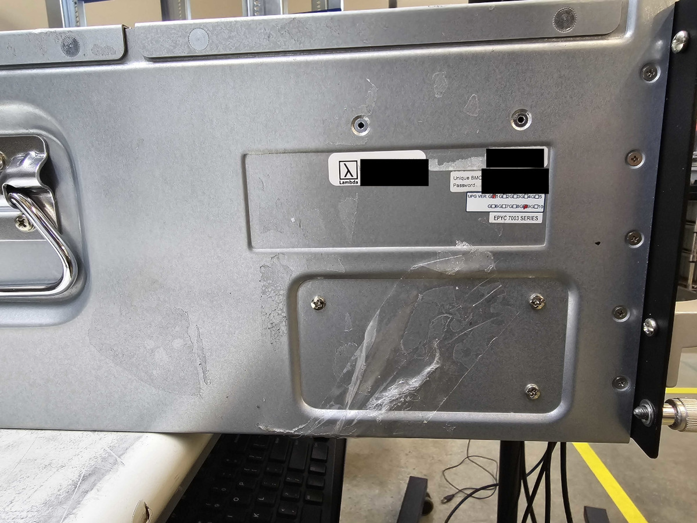
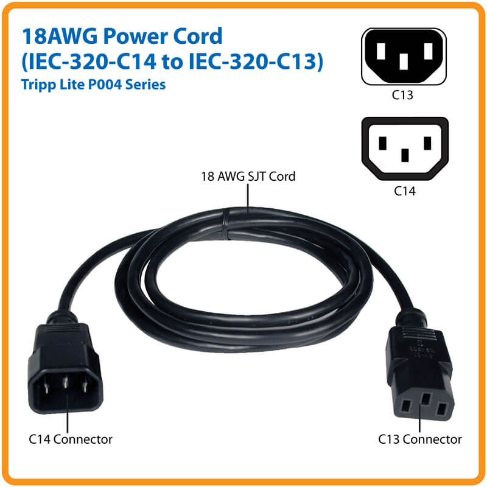
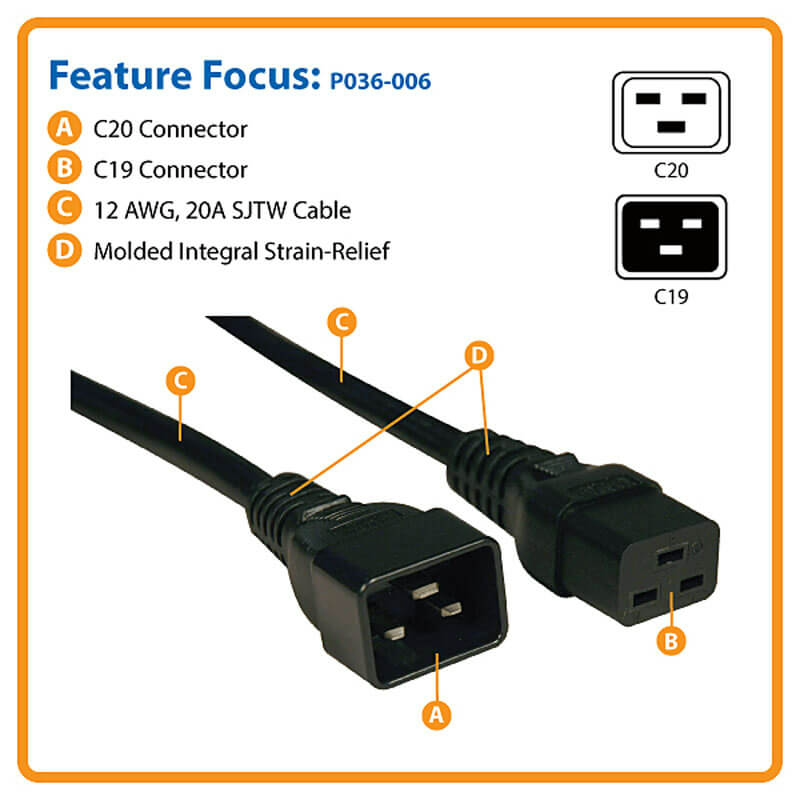

# Getting started

## Where can I download the user manual for my server chassis?

User manuals for Lambda server chassis can be downloaded below.

!!! tip

    You can run `sudo dmidecode -t 1` to know your server chassis. The command will output, for example:

    ```
    # dmidecode 3.2
    Getting SMBIOS data from sysfs.
    SMBIOS 3.3.0 present.
    # SMBIOS implementations newer than version 3.2.0 are not
    # fully supported by this version of dmidecode.
    Handle 0x0001, DMI type 1, 27 bytes
    System Information
    Manufacturer: Supermicro
    Product Name: AS -1114CS-TNR
    Version: 0123456789
    Serial Number: S452392X2826686
    UUID: 51605a00-c54f-11ec-8000-3cecefcdb48b
    Wake-up Type: Power Switch
    SKU Number: To be filled by O.E.M.
    Family: To be filled by O.E.M.
    ```

    `Product Name` is the server chassis. In this example, the server chassis is AS -1114CS-TNR.

### Supermicro

| Chassis                     | User manual                                                                |
| --------------------------- | -------------------------------------------------------------------------- |
| SuperServer 420GP-TNR       | [Download](https://www.supermicro.com/manuals/superserver/4U/MNL-2389.pdf) |
| AS -4124GO-NART             | [Download](https://www.supermicro.com/manuals/superserver/4U/MNL-2379.pdf) |
| AS -1124US-TNRP             | [Download](https://www.supermicro.com/manuals/superserver/1U/MNL-2286.pdf) |
| AS -1114CS-TNR              | [Download](https://www.supermicro.com/manuals/superserver/1U/MNL-2397.pdf) |
| AS -2124GQ-NART             | [Download](https://www.supermicro.com/manuals/superserver/2U/MNL-2356.pdf) |
| AS -4023S-TRT               | [Download](https://www.supermicro.com/manuals/superserver/4U/MNL-2037.pdf) |
| SuperServer 4029GP-TRT2     | [Download](https://www.supermicro.com/manuals/superserver/4U/MNL-2107.pdf) |
| SuperWorkstation 740GP-TNRT | [Download](https://www.supermicro.com/manuals/superserver/4U/MNL-2292.pdf) |
| AS -2124US-TNRP             | [Download](https://www.supermicro.com/manuals/superserver/2U/MNL-2288.pdf) |
| SuperServer 420GP-TNAR      | [Download](https://www.supermicro.com/manuals/superserver/4U/MNL-2350.pdf) |

### GIGABYTE

| Chassis  | User manual                                                                                                 |
| -------- | ----------------------------------------------------------------------------------------------------------- |
| R152-Z33 | [Download](https://download.gigabyte.com/FileList/Manual/server\_manual\_R152-Z33\_e\_10.pdf)               |
| G292-Z43 | [Download](https://download.gigabyte.com/FileList/Manual/server\_system\_manual\_G292-Z43\_e\_v10.pdf)      |
| G292-Z24 | [Download](https://download.gigabyte.com/FileList/Manual/server\_system\_manual\_G292-Z24\_e\_A00.pdf)      |
| G292-Z22 | [Download](https://download.gigabyte.com/FileList/Manual/server\_system\_manual\_g292-z20\_z22\_e\_1.0.pdf) |
| G292-Z42 | [Download](https://download.gigabyte.com/FileList/Manual/server\_system\_manual\_g292-z40\_z42\_e\_1.0.pdf) |
| G292-280 | [Download](https://download.gigabyte.com/FileList/Manual/server\_manual\_G292-280\_e\_10.pdf)               |

## Where do I find my server's serial number?

On the Supermicro server chassis, the serial number is on a service tag located at the front-bottom of the chassis.

<figure markdown="span">
  
  <figcaption>Serial number on the service tag of a Supermicro server chassis</figcaption>
</figure>


On GIGABYTE 2U server chassis, the serial number is on a sticker on the right side of the chassis.

On GIGABYTE 4U server chassis, the serial number is on a sticker on the left side of the chassis.

<figure markdown="span">
  
  <figcaption>Serial number on a sticker on the left side of a GIGABYTE 4U server chassis</figcaption>
</figure>

## Where can I find my server's IPMI (BMC) password?

!!! tip

    You can choose your own IPMI password for your server from within Ubuntu:

    1. Run `sudo apt-get install ipmitool` to install `ipmitool`, which is a program for managing IPMI functions.
    2. Run `ipmitool user list 1` to view the user list. Confirm that `ID 2` is `admin` or `ADMIN`.
    3. Run `ipmitool user set password 2` to set a new IPMI password.

### Supermicro

On Supermicro chassis, the IPMI password appears on one or more of the following:

* A sticker near the BMC (Baseboard Management Controller).
* A sticker near the motherboard serial number label.
* The service tag.

See Supermicro's [BMC Unique Password Guide \[PDF\]](https://www.supermicro.com/support/BMC\_Unique\_Password\_Guide.pdf) for more information.

### GIGABYTE

On GIGABYTE chassis, the IPMI password appears on one or more of the following:

* A sticker affixed to the motherboard.
* The chassis itself.

See GIGABYTE's [BMC Unique Pre-Programmed Password Reference Guide \[PDF\]](https://www.gigabyte.com/Fileupload/Global/Multimedia/101/file/573/1015.pdf) for more information.

## What are the power requirements for my server's PSUs?

The power requirements for Lambda server power supply units (PSUs) are as follows:

| Manufacturer | Model        | Wattage | Voltage (AC) | Current (A) | Frequency (Hz) | Inlet/Outlet | Efficiency               |
| ------------ | ------------ | ------- | ------------ | ----------- | -------------- | ------------ | ------------------------ |
| Supermicro   | PWS-2K05A-1R | 1000    | 100-127      | 12-9.5      | 60/50          | C14/C13      | 80 Plus Titanium (> 96%) |
|              |              | 1800    | 200-220      | 10-9.5      | 60/50          |              |                          |
|              |              | 1980    | 220-230      | 10-9.8      | 60/50          |              |                          |
|              |              | 2000    | 230-240      | 10-9.8      | 60/50          |              |                          |
| Supermicro   | PWS-2K08A-1R | 1800    | 200-220      | 10-9.8      | 60/50          | C14/C13      | 80 Plus Titanium (> 96%) |
|              |              | 1980    | 220-230      | 10-9.8      | 60/50          |              |                          |
|              |              | 2000    | 230-240      | 10-9.8      | 60/50          |              |                          |
| Supermicro   | PWS-3K02G-2R | 2880    | 200-207      | 16-15.7     | 60/50          | C20/C19      | 80 Plus Titanium (> 96%) |
|              |              | 3000    | 207.1-240    | 16-14.5     | 60/50          |              |                          |
| Supermicro   | PWS-3K06G-2R | 3000    | 207.1-240    | 16-14.5     | 60/50          | C20/C19      |                          |

\
Power connector inlets and outlets

This is what **C14 inlets** and **C13 outlets** look like:

<figure markdown="span">
  
  <figcaption>Power cord with C14 and C13 connectors</figcaption>
</figure>

This is what **C20 inlets** and **C19 outlets** look like:

<figure markdown="span">
  
  <figcaption>Power cord with C20 and C19 connectors</figcaption>
</figure>