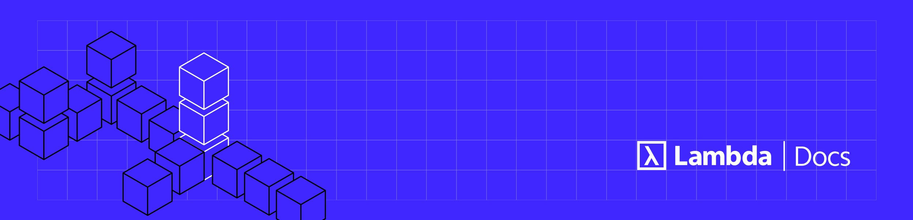

---
hide:
  - navigation
---

# Welcome to Lambda Docs

-   :lambda-public-cloud-icon:{ .lg .middle .lambda } **Public Cloud**

    ---

    Instantly launch a 16x to 512x NVIDIA H100 GPU cluster or a single-node
    instance. No long-term commitments required. Managed Kubernetes,
    Preinstalled Kubernetes, and Slurm are available. Our Public Cloud
    includes use of serverless APIs for inference.

    [:octicons-arrow-right-24: Introduction](public-cloud/index.md)

-   :lambda-private-cloud-icon:{ .lg .middle .lambda } **Private Cloud**

    ---

    Private Cloud is the ideal solution for organizations requiring a
    single-tenant cluster with greater than 512x GPUs. Private Cloud customers
    have low-level access to their cluster infrastructure. Managed Kubernetes,
    Preinstalled Kubernetes, and Slurm are available.

    [:octicons-arrow-right-24: Introduction](private-cloud/index.md)

-   :lambda-gpu-icon:{ .lg .middle .lambda } **Hardware**

    ---

    For individuals and small teams looking for on-prem hardware solutions, we
    offer our Scalar servers, and our Vector One, Vector, and Vector Pro
    workstations and desktops. Our servers, workstations, and desktops can be
    configured to meet your specific needs.

    [:octicons-arrow-right-24: Introduction](hardware/index.md)

-   :lambda-education-icon:{ .lg .middle .lambda } **Education**

    ---

    Our expert ML Engineers and Researchers have put together guides and
    tutorials to get you up and running quickly on Lambda's cloud and hardware
    solutions. Whether you're looking to fine-tune a model or host a
    load-balanced API server for inference, we have a guide for you.

    [:octicons-arrow-right-24: Introduction](education/index.md)

