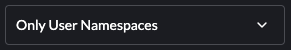
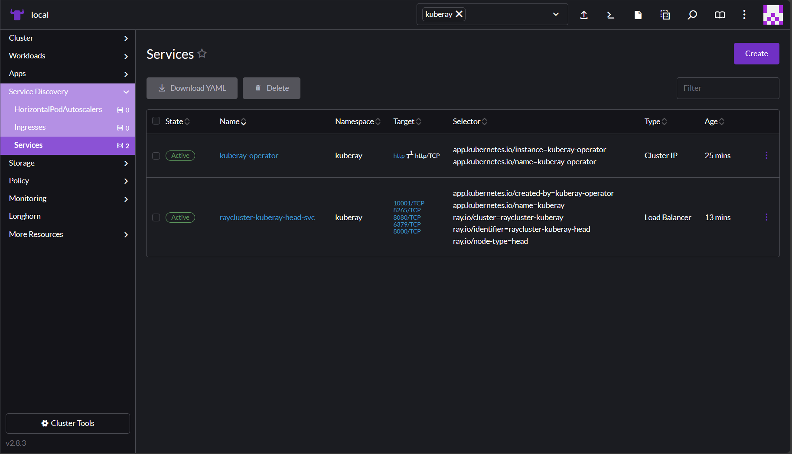
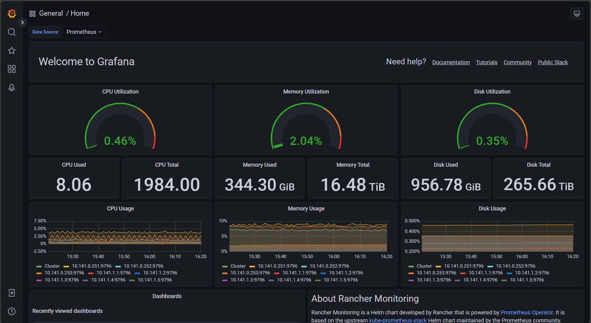
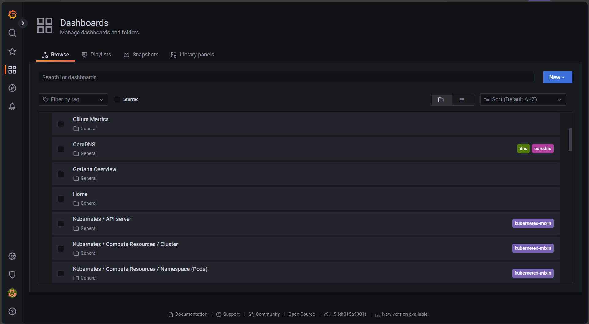
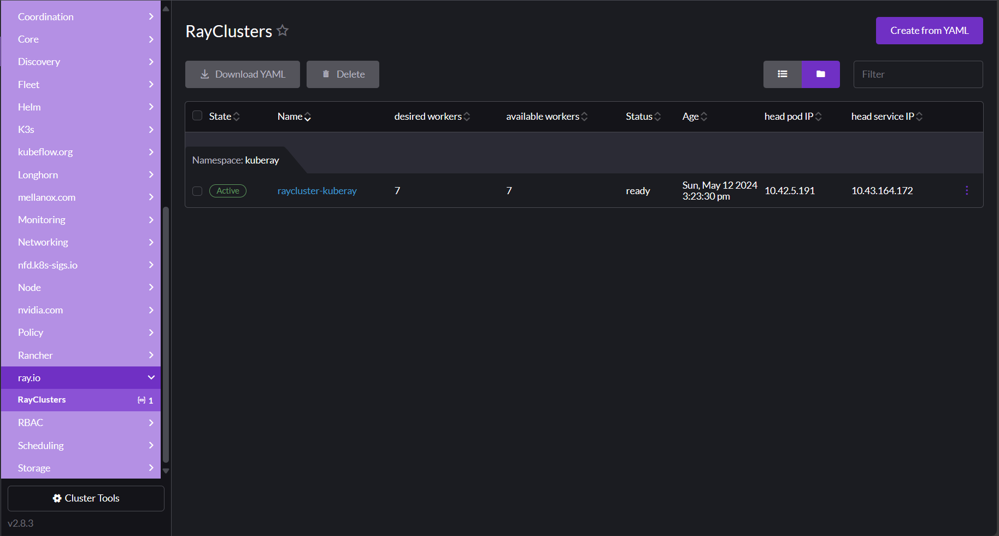
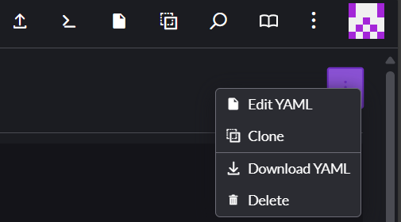
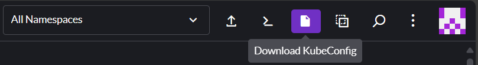
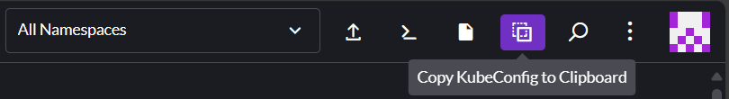

---
tags:
- private cloud
- managed kubernetes
---

# Getting started

This document explains how to access your Private Cloud cluster's Managed
Kubernetes dashboard and walks you through commonly used sections of your
cluster dashboard. It also provides guidance for configuring and running
workloads on your Private Cloud cluster.

For an overview of your Managed Kubernetes cluster's default specifications
and configuration, see the [Managed Kubernetes overview](index.md) for Private Cloud.

## Establishing a secure connection to your cluster { #establishing-a-secure-connection }

Your cluster uses Fortigate, Fortinet's Next-Generation Firewall (NGFW),
to protect your network and provide remote access services. To access your
cluster from your local computer:

!!! note

    These steps assume you're running Linux on your local machine. If you
    use FortiClient VPN on macOS and Windows, the steps might differ slightly.

1.  [Download and install FortiClient VPN](https://www.fortinet.com/support/product-downloads#vpn){ .external target="_blank" }
    from Fortinet's product download portal. If your local computer uses Red
    Hat, CentOS, or Fedora, choose the .rpm package. If your computer uses
    Debian or Ubuntu, choose the .deb package.
1.  In your local terminal, open FortiClient VPN:

    ```bash
    forticlient gui
    ```

1.  In the left nav of the resulting window, click **Remote access**.
1.  Click **Configure VPN**.
1.  On the New VPN Connection page, fill out the configuration form:
    -   *Connection name:* `Lambda Cluster`
    -   *Description:* `VPN connection to Lambda Cluster`
    -   *Remote Gateway:* Create an item for each of your control nodes' public
        IPs. For each IP, target port 10433 for each as shown in the example
        below:

        ```text { .no-copy }
        https://<NODE-PUBLIC-IP>:10433
        ```

1.  Click **Save** to finish creating your VPN connection profile.
1.  After setting up your profile, enter your username and password, and then
    click **Connect** to log into FortiClient.

You should now have full access to the cluster, as if it were part of your
local network.

## Accessing your cluster dashboard

After you establish your FortiClient VPN connection, navigate to
[https://10.141.3.1](https://10.141.3.1/){ .external target="_blank" } in your browser
and then log into your cluster's Rancher dashboard. You can find the login
details for your dashboard in your 1Password vault.

## Navigating the cluster dashboard

This section highlights some commonly used components of your cluster's
Rancher dashboard. For more guidance on using the Rancher dashboard, see the
[New User Guides section](https://ranchermanager.docs.rancher.com/how-to-guides/new-user-guides){ .external target="_blank" }
of the Rancher documentation.

### Viewing your cluster

When you log into the Rancher dashboard, you arrive at a page listing all
clusters. In the cluster list, click **local**, which should be the only
cluster in the list. You can also click the bull icon in the left nav to
access the cluster.

### Managing your nodes

To see an overview of your nodes, click **Cluster** in the left nav of your
cluster dashboard and then click **Nodes**. The Nodes page appears.


Click a node to see all resources associated with that node. Scroll down past
the labels and annotations to see details and metrics for the resources
running on your node.


### Managing your project resources { #managing-your-project-resources }

Rancher uses the concept of a *project* to tie users to clusters and
namespaces. When you create a new Private Cloud cluster with Managed
Kubernetes, Lambda automatically creates a project and namespace for
you that your user owns. You can control all of the resources
within this project, including its namespaces.

To view your projects and namespaces, click **Cluster** in the left nav of
your cluster dashboard, and then click **Projects/Namespaces**. You arrive at
the Projects/Namespaces page.


#### Creating new namespaces

Because Rancher manages the project/namespace mapping, you must use Rancher
to create new namespaces in your project. If you want to automate the
creation of new namespaces, you can use the
[Rancher CLI](https://github.com/rancher/cli){ .external target="_blank" } tool to do so.

#### Filtering your resources by namespace

The top bar of the dashboard provides a dropdown filter for projects/namespaces,
shown below. You can select multiple items from the list or type to filter
the entries then select the appropriate match. The filter applies to every view
in the UI.



### Managing your workloads

You interact with your workloads from the Workloads page and its subpages. To
access the Workload page, click **Workloads** in the left nav of your cluster
dashboard.


When you click **Workloads**, the left nav expands to reveal categories for
different resource types. The main Workloads dashboard shows all resources
and their resource types. You can switch between viewing the table as folders
per namespace or viewing it as a flat list by clicking the buttons to the
right of the **Filter** input above the table. You can also filter the view
by entering text into the **Filter** input.

### Managing your services

To access services, click **Service Discovery** in the left nav of your cluster
dashboard.

You might find it useful to filter by namespace here, as described in
[Managing your project resources](#managing-your-project-resources) above.
For example, in the screenshot below, the Services table has been filtered by
the namespace **kuberay**.  Looking at the namespace, you can see an internal
service of type `ClusterIP` and an external service of type `LoadBalancer`. The
**Target** column contains some details about exposed ports and their names,
if set.



In addition, you can view any ingresses that have been defined by clicking
**Service Discovery > Ingresses** in the left nav.

### Monitoring your cluster

Your cluster uses a high-availability Prometheus configuration. You can view
the resulting metrics by visiting your Grafana dashboard. To access the
dashboard, click **Monitoring** in the left nav of your cluster dashboard
and then click **Grafana**.

The main page of the Grafana dashboard covers some basic cluster metrics.



To browse dashboards for other resources, hover over the four-squares icon
in the left nav and select **Browse**.


You arrive at a list of available dashboards, as shown in the image below:



### Managing custom resources

You can view custom resources by clicking **More Resources** in your
cluster's left navigation panel. Your custom resources are grouped by the
custom resource definition (CRD) for which they're defined. For example,
in the screenshot below, the **RayCluster** is defined in the **ray.io** CRD
group:



After clicking on the resource in the nav, you can see any CRD-defined
statuses or other information it tracks, and then drill down into the
resource itself if you need to. Like most resources in the dashboard, you
can edit these resources directly by clicking the ⋮ menu in the upper
right corner of the resource and then selecting **Edit YAML**.



## Accessing the Kubernetes API { #accessing-the-kubernetes-api }

You can access the Kubernetes API at `https://10.141.0.250:6443` through your
SSL VPN connection. To download your cluster's `kubeconfig` file for use with
the API, click the page icon in the top right area of your cluster dashboard:



To copy the `kubeconfig` to your clipboard, click the copy icon in the top
right area of your dashboard.



## Configuring your workloads

### Adding tolerations

Your compute nodes are tainted to restrict what workloads get scheduled on them
to maximize the available resources for GPU jobs. The taint applied matches the
standard in other CSPs:

```text {.no-copy}
nvidia.com/gpu=true:NoSchedule
```

As a result, to schedule a workload to your compute nodes, you need to add the
following toleration to your deployment, job, or pod specs:

```yaml
tolerations:
  - key: nvidia.com/gpu
    value: "true"
    operator: Equal
    effect: NoSchedule
# or
tolerations:
  - { key: nvidia.com/gpu, value: "true", operator: Equal, effect: NoSchedule }
```

### Requesting NVIDIA resources

To allow pods to access your cluster's GPU and Infiniband resources, Lambda
deploys the NVIDIA GPU Operator and NVIDIA Network Operator in your cluster.
You can request these two operators in your specs as follows:

!!! note

    By default, Lambda configures the NVIDIA Network Operator to deploy a single
    shared RDMA device. The YAML below reflects this default. You can request a
    different configuration if needed.

```yaml
limits:
  cpu:
  memory: "1Ti"
  nvidia.com/gpu: 8
  rdma/rdma_shared_device_a: 1
requests:
  cpu: "128"
  memory: "1Ti"
  nvidia.com/gpu: 8
  rdma/rdma_shared_device_a: 1
```
