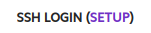

# Introduction

1-Click Clusters (1CC) are clusters of GPU and CPU instances consisting of 16 to 512 NVIDIA H100 SXM Tensor Core GPUs. Compute (GPU) nodes are interconnected over an NVIDIA Quantum-2 400Gb/s InfiniBand non-blocking fabric in a rail-optimized topology, providing peer-to-peer GPUDirect RDMA communication of up to 3200Gb/s. All nodes are connected via 2x100Gb/s Ethernet for IP communication and are connected to the Internet via 2x100Gb/s Direct Internet Access (DIA) circuits.

Each 1CC includes 3x CPU management (head) nodes for use as jump boxes (bastion hosts) and for cluster administration and job scheduling. These management nodes are assigned public IP addresses and are directly accessible over the Internet via SSH.

All nodes can be directly accessed using [Jupyter Notebook](../on-demand/getting-started.md#how-do-i-open-jupyter-notebook-on-my-instance) from the Lambda On-Demand Cloud dashboard.

1CC nodes are in an isolated private network and can communicate freely with each other using private IP addresses.

Generic CPU nodes can optionally be launched in the same regions as 1CCs. These generic CPU nodes run independently of 1CCs and don't terminate when 1CC reservations end.

Each compute node includes 24TB of usable local ephemeral NVMe storage. Each management node includes 208GB of usable local ephemeral NVMe storage. [Persistent storage](../filesystems.md) is automatically created and attached to each 1CC node, and can also be attached to on-demand instances. Existing file systems in the same region can additionally be attached. [You’re billed only for the storage you actually use](../filesystems.md#how-are-filesystems-billed).

All 1CC nodes are preinstalled with Ubuntu 22.04 LTS and [Lambda Stack](https://lambdalabs.com/lambda-stack-deep-learning-software), including NCCL, Open MPI, PyTorch with DDP and FSDP support, TensorFlow, OFED, and other popular libraries and frameworks for distributed ML workloads, allowing ML engineers and researchers to begin their large-scale experiments and other work immediately after launching a 1CC.

## Reserving 1-Click Clusters

To reserve a 1CC:

1. [Log into](https://cloud.lambdalabs.com/cloud/login) your Lambda On-Demand Cloud account. If you don’t already have an account, you can [create an account for free](https://cloud.lambdalabs.com/sign-up).
1. If you haven’t already, [generate or add an SSH key](../on-demand/dashboard.md#add-generate-and-delete-ssh-keys) for your 1CC.
1. Navigate to the [1-Click Clusters page](https://cloud.lambdalabs.com/one-click-clusters/running) of the Lambda Cloud dashboard and click **Reserve 1-Click Cluster**.
1. Use the 1CC reservation wizard to reserve your cluster.
    1. *Type/Duration:* Enter the duration in weeks that you want to reserve the cluster, and then select the cluster type you want to launch.
    1. *Region:* Select the region in which you want to launch your cluster.
    1. *Filesystem:* Optionally, select an existing file system that you want to attach to the cluster, or click **Create a new  filesystem** to create a new file system. If you don’t want to attach an existing file system or create a new file system, click **Don’t attach a filesystem (an empty one will be created)**.
    1. *SSH Key:* Select the SSH key that you want to use to access your cluster, then click **Next**.
    1. *Cluster name:* Enter a name for your cluster, then click **Continue to Payment**. You’re presented with a billing summary and the billing information you have saved to your Lambda On-Demand Cloud account.
1. If needed, update your billing information and change the email address where you’d like the invoice for your 1CC reservation to be sent.

    !!! note

        Only the invoice will be sent to this email address. All notifications and other information regarding your 1CC will be sent to the email address associated with your account.

1. Review the listed policies and terms of service. If you agree to the policies and terms of service, click the checkbox under **Terms and Conditions**.
1. Click **Submit reservation request**. Within a few minutes, you’ll receive an email confirming your 1CC reservation request.

You can check the status of your 1CC reservation request or cancel your request by visiting the [Instances page](https://cloud.lambdalabs.com/instances) in the Lambda Cloud dashboard.

### Completing your 1-Click Cluster reservation

When your reservation is approved, you’ll receive an email with your invoice and payment instructions.
This email will be sent to the address you entered when making your reservation, which might be different from the email associated with your Lambda account.

**The invoice must be paid within 10 days of approval of your 1CC reservation. Otherwise, you risk losing your reservation.** Daily reminder emails will be sent until the invoice is paid or the reservation is canceled.

Your 1CC will automatically launch on the day your reservation begins. You’ll be sent an email informing you that your cluster is launching, and that you should check your dashboard to monitor the status of your 1CC.

## Accessing your 1-Click Cluster

Your 1CC's management nodes have public IP addresses and can be accessed directly via SSH. You can access your compute nodes via SSH using a management node as a jump box. You can also access both your management nodes and your compute nodes using [Jupyter Notebook](../on-demand/getting-started.md#how-do-i-open-jupyter-notebook-on-my-instance).
If you want to access your management nodes through SSH, make sure your [Firewall rules](https://cloud.lambdalabs.com/firewall) are configured to allow SSH traffic.

To access your management nodes and compute nodes via SSH:

1. [Log into](https://cloud.lambdalabs.com/cloud/login){ .external target="_blank" } your Lambda On-Demand Cloud account. Then, click **1-Click Clusters** in the left sidebar of the dashboard.

1.  At the top of the table of your 1CC’s nodes, next to **SSH LOGIN**, click **SETUP**.

    

    Follow the instructions in the **INITIAL CLUSTER SETUP** dialog, then click **Next**.

    !!! tip

        Follow these instructions on any other computers you want to use to access your 1CC. Make sure those computers have the SSH key that you chose when you reserved your 1CC.

1.  Follow the instructions in the **SETUP INTER-NODE PASSWORDLESS SSH** dialog. You can now SSH into each of your nodes using their names, which you can obtain from the dashboard. You can also SSH from each of your nodes into the other nodes.

    !!! warning

        The computer where you’re running the script must have both your cluster SSH config, downloaded in the previous step, and the SSH key that you chose when you reserved your 1CC.

1.   Click **Done** to close the dialog.

### Adding SSH keys

You can add SSH keys to your 1CC to allow others to log in.

To add another SSH key:

1. [From the dashboard](https://cloud.lambdalabs.com/one-click-clusters/running), save the names of your 1CC nodes into a text file. You can do this by copy and pasting from the dashboard. The file should contain the names of your nodes, each on a separate line, and should look like:

    ```{ .text .no-copy }
    us-east-2-1cc-node-1
    us-east-2-1cc-node-2
    us-east-2-1cc-node-3
    us-east-2-1cc-node-4
    us-east-2-1cc-head-1
    us-east-2-1cc-head-2
    us-east-2-1cc-head-3
    ```

1. Add the additional SSH key to your 1CC by running:

    ```bash
    while read node; \
    do ssh -n -F CLUSTER-SSH-CONFIG "$node" "echo 'PUBLIC-KEY' >> ~/.ssh/authorized_keys" && echo "Key added to $node"; \
    done < LIST-OF-NODES
    ```
    In this command:

    *  Replace `CLUSTER-SSH-CONFIG` with the path to your cluster SSH config. The path should look like `~/.ssh/config.d/config.us-east-2-1cc`.
    *  Replace `PUBLIC-KEY` with the public key you want to add to your 1CC nodes. Public keys look like:

        ```{ .text .no-copy }
        ssh-ed25519 AAAAC3NzaC1lZDI1NTE5AAAAIK5HIO+OQSyFjz0clkvg+48YAihYMo5J7AGKiq+9Alg8 user@hostname
        ```

    *  **Make sure to keep the single quotes (**`' '`**).**
    *  Replace `LIST-OF-NODES` with the name of the file containing the names of your nodes.


## Copying data to your 1-Click Cluster

The recommended way to copy data to your 1CC is to use rsync. rsync allows you to copy files from your computer to your 1CC, as well as directly from a running on-demand instance to your 1CC.

[See our documentation to learn how to use rsync](../../education/linux-usage/basic-linux-commands-and-system-administration.md#using-rsync-to-copy-and-synchronize-files). When following the instructions, replace **SERVER-IP** with the name of one of your management nodes.
Unless you copy your data to a persistent storage file system, your data will only be accessible from the nodes your data was copied to.

If your data isn’t saved to a persistent storage file system, you can copy your data from one node to another by following [our instructions on copying files directly between remote servers](../../education/linux-usage/basic-linux-commands-and-system-administration.md#copy-files-directly-between-remote-servers).
For [higher performance](../filesystems.md#preserving-the-state-of-your-system), you can also use rsync to copy data from your persistent storage file system to your nodes’ local ephemeral storage.


## Ending your 1-Click Cluster reservation

Beginning three days prior to your 1CC reservation ending, you’ll be sent a daily email reminding you that your reservation is ending.

!!! warning

    All data saved to ephemeral local storage will be deleted and unrecoverable once your reservation ends! You’re responsible for backing up your data, for example, to a persistent storage file system.

It’s not currently possible to extend or renew your 1CC reservation. You’ll need to request a new reservation.
