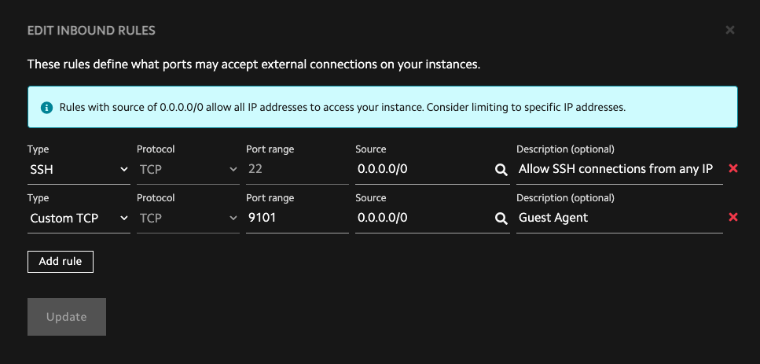

# Installing the guest agent and getting started with Prometheus and Grafana

## Introduction

!!! note

    The guest agent is currently an alpha release. The guest agent is under
    active development and might contain bugs, incomplete features, and other
    issues that might affect performance, security, and reliability. The guest
    agent currently should only be used for testing and evaluation.

    **The guest agent currently shouldn't be used in production environments**.

    Please report any bugs you
    encounter to [Lambda's Support team
    :octicons-link-external-16:](https://lambdalabs.com/support){target="_blank"}.

You can install the guest agent on your [Lambda Public Cloud
:octicons-link-external-16:](https://lambdalabs.com/service/gpu-cloud){target="_blank"}
on-demand instances to gather metrics such as GPU and CPU utilization.

In this tutorial, you'll install the guest agent and set up [Prometheus
:octicons-link-external-16:](https://www.prometheus.io/){target="_blank"} and
[Grafana :octicons-link-external-16:](https://grafana.com/){target="_blank"}
with an example dashboard so you can visualize the collected metrics.

## Install the guest agent

To install the guest agent on an on-demand instance:

First, SSH into your instance by running:

```bash
ssh ubuntu@IP-ADDRESS -L 3000:localhost:3000
```

Replace `IP-ADDRESS` with the actual IP address of your instance.

!!! note

    The `-L 3000:localhost:3000` option enables local port forwarding. Local
    port forwarding is needed to access the Grafana dashboard you'll create
    in a later step. [See the SSH man page to learn
    more](https://manpages.ubuntu.com/manpages/jammy/en/man1/ssh.1.html).

Then, download and install the guest agent by running:

```bash
curl -L https://lambdalabs-guest-agent.s3.us-west-2.amazonaws.com/scripts/install.sh | sudo bash
```

## Set up Prometheus and Grafana

To set up Prometheus and Grafana:


1. Clone the [Awesome Compose GitHub repository
   :octicons-link-external-16:](https://github.com/docker/awesome-compose){target="_blank"}
   and change into the `awesome-compose/prometheus-grafana` directory by running:

    ```bash
    git clone https://github.com/docker/awesome-compose.git && cd awesome-compose/prometheus-grafana
    ```

1. Obtain the private IP address of your instance by running:

    ```bash
    ip -4 -br addr show eno1 | grep -Eo '(25[0-5]|2[0-4][0-9]|[01]?[0-9][0-9]?)\.(25[0-5]|2[0-4][0-9]|[01]?[0-9][0-9]?)\.(25[0-5]|2[0-4][0-9]|[01]?[0-9][0-9]?)\.(25[0-5]|2[0-4][0-9]|[01]?[0-9][0-9]?)'
    ```

1. Edit the `prometheus/prometheus.yml` file.

    Under `targets`, change `localhost:9090` to `PRIVATE-IP-ADDRESS:9101`.

    Replace `PRIVATE-IP-ADDRESS` with the private IP address of your instance,
    which you obtained in the previous step.

    !!! note

        Make sure you're changing both the host and the port. It's frequently
        overlooked that the port is being changed as well as the host.

    In the `prometheus.yml` file, the `scrape_configs` key should look like:

    ```{.yaml .no-copy}
    scrape_configs:
    - job_name: prometheus
      honor_timestamps: true
      scrape_interval: 15s
      scrape_timeout: 10s
      metrics_path: /metrics
      scheme: http
      static_configs:
      - targets:
        - PRIVATE-IP-ADDRESS:9101
    ```

1. Edit the `compose.yaml` file and set `GF_SECURITY_ADMIN_PASSWORD` to a strong
   password.

    !!! tip

        You can generate a strong password by running:

        ```bash
        openssl rand -base64 16
        ```

1. Start Prometheus and Grafana containers on your instance by running:

    ```bash
    sudo docker compose up -d
    ```

1. In your web browser, go to [http://localhost:3000
   :octicons-link-external-16:](http://localhost:3000){target="_blank"} and log
   into Grafana. For the username, enter `admin`. For the password, enter the
   password you set earlier.

1. At the top-right of the dashboard, click the **+**. Then, choose **Import
   dashboard**.

    

1. In the **Import via dashboard JSON model** field, enter the [example JSON
   model
   :octicons-link-external-16:](https://gist.githubusercontent.com/LandonTClipp/964e90507d660e3fb710b4137be6cd6f/raw/bc7abd797da65581534513c153d1ad3d1b8e4bbe/lambda-guest-agent-grafana-model.json){target="_blank"}
   prepared for this tutorial, then click **Load**. In the following screen,
   click **Import**.

1. You'll see a Grafana dashboard displaying:

    - CPU usage
    - GPU utilization
    - GPU power draw
    - InfiniBand transfer rates
    - local storage transfer rates

    

    !!! note

        On-demand instances, unlike
        [1-Click Clusters](../1-click-clusters/index.md), don't use InfiniBand
        fabric. Accordingly, the InfiniBand transfer rates will always be zero.

### Public Internet Routing

The Prometheus client that guest-agent exposes listens on `http://0.0.0.0:9101` for the Alpha and Beta tests. This client is provided as a courtesy that enables customers to self-host their own Grafana and Prometheus stack, as described in prior sections. guest-agent will remove the Prometheus client during the GA release once visualization dashboards are available on [https://cloud.lambdalabs.com :octicons-link-external-16:](https://cloud.lambdalabs.com).

#### 1CC

GPU nodes in a 1-Click-Cluster have private IPs only accessible from the head node. You may use these IPs without any special firewall configuration.

#### On-Demand

On-Demand instances only provide public IP addresses. In order to gain access to the Prometheus client running on your On-Demand nodes, you have a few options:

=== "SSH Tunnel"


    ```
    ssh -L [local_port]:[remote_host]:[remote_port] [username]@[ssh_server]
    ```
    <div class="result" markdown>
    ```mermaid
    flowchart LR
        subgraph OnDemand
            guestAgent[lambda-guest-agent.service]
            SSHServer
            SSHServer --> guestAgent
        end

        subgraph PrometheusServer
            SSHTunnel
            Prometheus
            Grafana
        end

        SSHTunnel -->|SSH Tunnel| SSHServer
        Prometheus --> SSHTunnel
        Grafana --> Prometheus

    ```
    </div>

    This will tunnel the Prometheus listener through SSH to your localhost. This would typically be done on the same server that is running your Prometheus server. You can then configure Prometheus to scrape each `localhost:[local_port]` that you have defined.

=== "Cloudflare Tunnel"

    If you have a Cloudflare account, you can use their [tunneling services :octicons-link-external-16:](https://developers.cloudflare.com/cloudflare-one/connections/connect-networks/) to safely expose a publicly-accessible address to the Prometheus client.

    ```mermaid
    flowchart LR
        subgraph OnDemand
            guestAgent[lambda-guest-agent.service]
            cloudflared[cloudflared.service]
            cloudflared --> guestAgent
        end

        CloudflareCDN

        CloudflareCDN --> cloudflared

        subgraph PrometheusServer
            Prometheus
        end

        Prometheus --> CloudflareCDN
    ```

=== "Non-Tunnelled"

    !!! danger

        This is not recommended as it publicly exposes the Prometheus client with no authentication or encryption!

    If you set a firewall rule on the Lambda front-end, you can expose the Prometheus client from lambda-guest-agent to the public internet:

    
